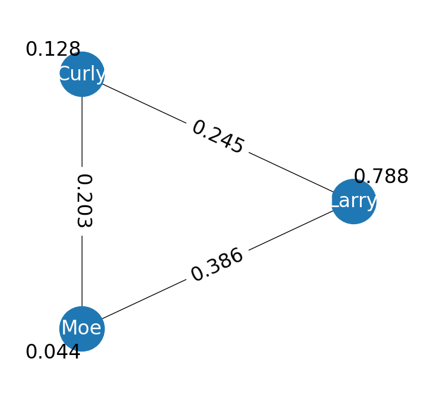

Getting Started
===============

Installation
------------

EffiARA is currently in active development and a PyPI package is in the works.
In the meantime, you can install EffiARA like so.

.. code-block:: bash

   git clone https://github.com/MiniEggz/EffiARA.git
   cd EffiARA
   pip install -r requirements.txt
   python setup.py develop

Fundamentals
------------

Data Format
...........

EffiARA assumes a common data format for all annotations. This format is a :code:`pandas.DataFrame`
object with a column for each annotation from each annotator. The column name format for a user's annotations is
:code:`{username}_label` and each row is a unique sample.

Let's assume we have the following CSV file saved as "example.csv".

.. csv-table:: example.csv
   :header: "Larry_label", "Curly_label", "Moe_label"

   "yes", "no", "yes"
   "no", "no", 
   , "yes", "yes"
   "no", "no", "no"

We thus have three annotators --Larry, Curly, and Moe-- and four examples. Our task is binary with 
"yes" or "no" labels. We also see that some annotators have not annotated some samples. This is fine. 
EffiARA will account for this when computing agreement. Let's read this data into Python.

.. code-block:: python

   import pandas as pd
   annotations = pd.read_csv("example.csv")
   print(annotations)

        Larry_label Curly_label Moe_label
   0         yes          no       yes
   1          no          no       NaN
   2         NaN         yes       yes
   3          no          no        no

Computing Agreement
...................

Computing agreement between our annotators is done using the `Annotations` class. We simply instantiate
this class with our annotations DataFrame and get agreements and annotator reliabilities like so.

.. code-block:: python

   from effiara.annotator_reliability import Annotations
   # overlap_threshold is the minimum number of samples
   # annotated by a pair of annotators to compute inter-annotator
   # agreement. It's default is 15, so we need to set it lower
   # because we only have 4 examples. 
   annos = Annotations(annotations, overlap_threshold=1)
   print(annos)

   Node Larry has the following attributes:
   reliability: 1.040292317713493
   intra_agreement: 1
   avg_inter_agreement: 0.5874928354635361

   Node Curly has the following attributes:
   reliability: 0.8083601730435107
   intra_agreement: 1
   avg_inter_agreement: 0.2335628758666486

   Node Moe has the following attributes:
   reliability: 1.151347509242996
   intra_agreement: 1
   avg_inter_agreement: 0.7569637792475039

Minimum Working Example
-----------------------

.. literalinclude:: ../../examples/minimal.py
   :language: python

The graph should look something like this.

